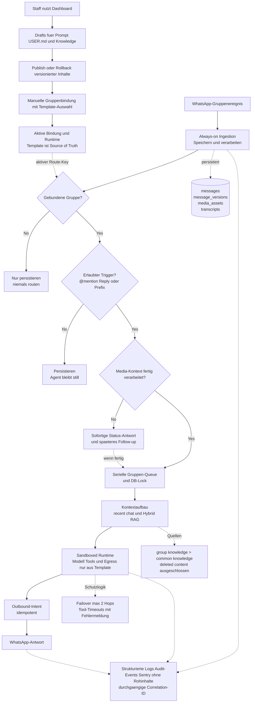

# PRD Flowchart

```mermaid
flowchart TD
    A[Staff nutzt Dashboard] --> B[Drafts fuer Prompt USER.md und Knowledge]
    B --> C[Publish oder Rollback versionierter Inhalte]
    C --> D[Manuelle Gruppenbindung mit Template-Auswahl]
    D --> E[Aktive Bindung und Runtime<br/>Template ist Source of Truth]

    F[WhatsApp-Gruppenereignis] --> G[Always-on Ingestion<br/>Speichern und verarbeiten]
    G --> H{Gebundene Gruppe?}
    E -. aktiver Route-Key .-> H
    H -->|No| I[Nur persistieren<br/>niemals routen]
    H -->|Yes| J{Erlaubter Trigger?<br/>@mention Reply oder Prefix}
    J -->|No| K[Persistieren<br/>Agent bleibt still]
    J -->|Yes| L{Media-Kontext fertig verarbeitet?}
    L -->|No| M[Sofortige Status-Antwort<br/>und spaeteres Follow-up]
    M -. wenn fertig .-> N[Serielle Gruppen-Queue<br/>und DB-Lock]
    L -->|Yes| N
    N --> O[Kontextaufbau<br/>recent chat und Hybrid RAG]
    O --> P[Sandboxed Runtime<br/>Modell Tools und Egress nur aus Template]
    P --> Q[Outbound-Intent<br/>idempotent]
    Q --> R[WhatsApp-Antwort]

    G -. persistiert .-> S[(messages<br/>message_versions<br/>media_assets<br/>transcripts)]
    O -. Quellen .-> T[group knowledge > common knowledge<br/>deleted content ausgeschlossen]
    P -. Schutzlogik .-> U[Failover max 2 Hops<br/>Tool-Timeouts mit Fehlermeldung]

    G -.-> V[Strukturierte Logs Audit-Events Sentry ohne Rohinhalte<br/>durchgaengige Correlation-ID]
    P -.-> V
    R -.-> V
```
